<a href="https://dayanalorza.com">
  <picture>
    <source media="(prefers-color-scheme: light)" srcset="./assets/banner.svg">
    <source media="(prefers-color-scheme: dark)" srcset="./assets/banner.svg">
    
  </picture>
</a>

Always fascinated by the latest tech. Currently building AI employees, web apps, and AI automation.

## Now

Founder/Principal at [Kwantum Tech](https://kwantumtech.com), a one-woman agency shipping web/mobile apps and AI-native automation end-to-end; previously Apple, Cisco, Palo Alto Networks, Fanfix, and Sapient.  
Open to senior/staff frontend roles.

## Recently shipped

<!-- shipped starts -->
- [dayanalorza](https://github.com/DayanaLorza/dayanalorza) — Profile README — last updated 2026-08-06
- [kwantum](https://github.com/DayanaLorza/kwantum) — Kwantum Tech — last updated 2026-08-06
- [hermes-latoya](https://github.com/DayanaLorza/hermes-latoya) — Hermes — last updated 2026-06-25
- [portfolio](https://github.com/DayanaLorza/portfolio) — Portfolio — last updated 2026-08-06
<!-- shipped ends -->

## Stack I reach for

| Frontend | Backend | AI |
| --- | --- | --- |
| React · Next.js · TypeScript · Svelte 5/SvelteKit · design systems | Node · PostgreSQL/Supabase · GraphQL | LLM agents |

## Selected work

- [kwantumtech.com](https://kwantumtech.com) — the agency I’m building and shipping from.
- [dayanalorza.com](https://dayanalorza.com) — my personal home on the web.
